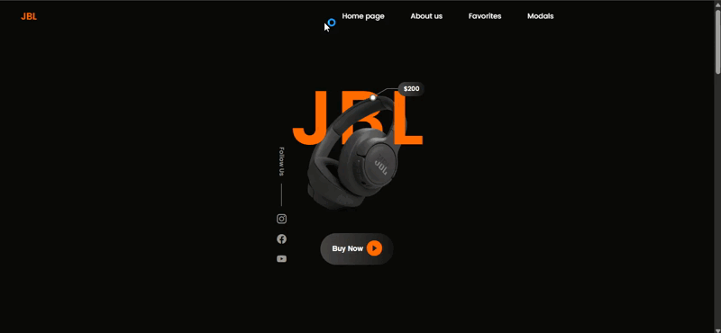

# 🎧 JBL Landing Page Website

**JBL** is a modern, clean, and fully responsive product landing page website. Built using **HTML**, **SCSS (Sass)**, and **Bootstrap Icons**, this website is designed to showcase JBL audio products in a visually engaging and user-friendly way.

---
## ⚙️ Features

✅ **Responsive Design**
Optimized for mobile, tablet, and desktop devices. 

✅ **Animated Headings & Buttons**
Smooth visual interactions that enhance user engagement. 

✅ **Product Favorites Section**
Display of different product models with images and captions.  

✅ **Tooltip Highlights**
Interactive labels pointing out product features.  

✅ **About Section**
Brief information about the company or product line.

✅ **Sponsor Logos**
Trusted brands associated with JBL are highlighted. 

✅ **Social Media Links**
Instagram, Facebook, and YouTube icons for user interaction.  

✅ **Email Subscription Form**
Simple input field for collecting user emails.

---

## 🛠 Technologies Used

- **HTML5** – Markup structure of the site.  
- **SCSS (Sass)** – Modular and maintainable CSS styling.  
- **Bootstrap Icons** – Modern icon library for UI elements.  
- **Google Fonts (Poppins)** – Clean and professional typography.

---

## 🔍 Preview  

  

---

## 📞 Contact  

📩 **Email:** [saadetnajaf@gmail.com](mailto:saadetnajaf@gmail.com)  
📷 **Instagram:** [@saadet_najaf](https://www.instagram.com/saadet_najaf)  
💼 **LinkedIn:** [Saadet Najaf](https://www.linkedin.com/in/saadetnajaf/)  
